# AI Revenue Recovery Agent

> Payment Degradation → Root Cause → Recovery Action

AI Revenue Recovery Agent is an intelligent autonomous payment failure recovery pipeline. It ingests failed payment events, identifies root causes, decides compliant and bounded recovery actions (with strict stopping rules and circuit breakers), simulates execution, and evaluates performance against known ground truth.

Built for **Razorpay Buildathon — Track 03 (AI Revenue Recovery)**.

---

## Highlights

- **Honest Metrics:** Evaluated against synthetic payment streams with known ground truth — computes actual recovery rate, false-retry cost, time-to-recovery, and precision/recall.
- **Strictly Bounded Decisions:** Enforces a hard cap of max 3 retries, cause-based cooldown intervals, and zero retries for non-recoverable failures.
- **Compliant Escalation:** Immediately routes unrecoverable errors (`risk_block`, `invalid_credentials`) to human queues.
- **Merchant Circuit Breaker:** Dynamically halts automated recovery if a merchant exceeds a 40% failure rate in a rolling 15-minute window.
- **Immutable Audit Trail:** Append-only audit trail logging every event transition across all stages (`ingest` → `classify` → `decide` → `execute`).

---

## Architecture Overview

```mermaid
flowchart LR
    DG["Synthetic Data Generator\n(known ground truth)"] -->|payment events| S1[("Event Stream\nraw-payment-events")]

    S1 --> ING["Ingestion Service\nnormalize + validate + dedupe"]
    ING -->|normalized event| S2[("Event Stream\nnormalized-events")]
    ING -->|log| AUD[("Audit Store\nappend-only")]

    S2 --> CLS["Classifier Service\nroot-cause + confidence"]
    CLS -->|classification| S3[("Event Stream\nclassifications")]
    CLS -->|log| AUD

    S3 --> DEC["Decision Engine\ncause → action, stopping rules"]
    DEC -->|decision| S4[("Event Stream\ndecisions")]
    DEC -->|log| AUD

    S4 --> EXE["Action Executor\nretry / notify / escalate\n(simulated, rate-limited)"]
    EXE -->|result| AUD

    AUD --> MET["Batch Metrics Evaluator\nrecovery rate, false-retry cost,\ntime-to-recovery, precision/recall"]
    AUD --> DASH["CLI / Dashboard\ndemo view of the decision trail"]
    MET --> DASH
```



---

## Repository Structure

```
revenue-recovery-agent/
├── README.md                     # Project overview and run guide
├── docs/                         # Specification and planning docs
│   ├── 00-README.md
│   ├── 01-architecture.md
│   ├── 02-repo-structure.md
│   ├── 03-event-schema-contracts.md
│   └── 04-phased-development-plan.md
│
├── cmd/                          # Runnable service entrypoints
│   ├── datagen/                  # Synthetic payment data generator CLI
│   ├── ingest/                   # Ingestion & normalization service
│   ├── classifier/               # Root-cause classifier service
│   ├── decision/                 # Decision engine & stopping rules
│   ├── executor/                 # Simulated recovery action executor
│   └── batch-eval/               # Batch metrics evaluator CLI
│
├── internal/                     # Core internal business logic & contracts
│   ├── events/                   # Canonical schema contracts & JSON models
│   ├── stream/                   # Swappable Pub/Sub stream interfaces (Redis/Kafka)
│   ├── classify/                 # Rule-based & ML classification engine
│   ├── decide/                   # Decision rules, stopping rules & circuit breakers
│   ├── execute/                  # Simulated execution & rate limiting
│   ├── audit/                    # Append-only audit store (SQLite / JSONL)
│   └── metrics/                  # Evaluation formulas & report generators
│
├── data/
│   ├── synthetic/                # Generated raw payment event streams
│   └── ground-truth/             # Ground-truth labels for evaluation
│
├── dashboard/                    # Visual CLI / Web demo audit inspector
├── deploy/                       # Local docker-compose & Kubernetes deployment
├── scripts/                      # End-to-end automation scripts
├── go.mod                        # Go module
└── Makefile                      # Build and run commands
```

---

## Quickstart

### Prerequisites
- Go 1.22+
- Docker & Docker Compose

### Commands
```bash
# Generate synthetic dataset and ground truth
make demo-data

# Start Redis and supporting services
docker-compose -f deploy/docker-compose.yml up -d

# Run end-to-end pipeline batch
make batch

# Run automated tests
make test
```

---

## Documentation

- [00-README: Project Overview](docs/00-README.md)
- [01-Architecture & Components](docs/01-architecture.md)
- [02-Repository Structure](docs/02-repo-structure.md)
- [03-Event Schema Contracts](docs/03-event-schema-contracts.md)
- [04-Phased Development Plan](docs/04-phased-development-plan.md)
# AI_RECOVERY_AGENT
