# Architecture

## System diagram

```mermaid
flowchart LR
    DG["Synthetic Data Generator\n(known ground truth)"] -->|payment events| S1[("Event Stream\nraw-payment-events")]

    S1 --> ING["Ingestion Service\nnormalize + validate + dedupe"]
    ING -->|normalized event| S2[("Event Stream\nnormalized-events")]
    ING -->|log| AUD[("Audit Store\nappend-only")]

    S2 --> CLS["Classifier Service\nroot-cause + confidence"]
    CLS -->|classification| S3[("Event Stream\nclassifications")]
    CLS -->|log| AUD

    S3 --> DEC["Decision Engine\ncause → action, stopping rules"]
    DEC -->|decision| S4[("Event Stream\ndecisions")]
    DEC -->|log| AUD

    S4 --> EXE["Action Executor\nretry / notify / escalate\n(simulated, rate-limited)"]
    EXE -->|result| AUD

    AUD --> MET["Batch Metrics Evaluator\nrecovery rate, false-retry cost,\ntime-to-recovery, precision/recall"]
    AUD --> DASH["CLI / Dashboard\ndemo view of the decision trail"]
    MET --> DASH
```

## Components

| Component | Responsibility | Input | Output |
|---|---|---|---|
| **Synthetic Data Generator** | Produces realistic payment event streams *with known ground truth* (what actually should have happened), so the batch evaluator has something to score against | config (volume, failure mix) | `raw-payment-events` stream + a ground-truth file |
| **Ingestion Service** | Validates incoming events against the schema, dedupes by `event_id`, normalizes into canonical form | raw event stream | `normalized-events` stream |
| **Classifier Service** | Assigns a root-cause bucket + confidence to each failure event. Rule-based first; a model can sit behind the same interface later without changing anyone else's code | normalized event | classification record |
| **Decision Engine** | Maps `(root_cause, transaction history, merchant state)` → action. Owns all stopping-rule logic (max retries, cooldowns, merchant circuit breaker) | classification | decision record |
| **Action Executor** | Executes the decided action against a simulated downstream (retry call, notification, escalation queue). Enforces rate limits so it can't violate the decision's bounds | decision | action result |
| **Audit Store** | Append-only log of every event, classification, decision, and action result. Single source of truth for the demo and the metrics | everything above | queryable audit trail |
| **Batch Metrics Evaluator** | Replays a batch against ground truth, computes recovery rate, false-retry cost, time-to-recovery, and classification precision/recall | audit store + ground truth | metrics report |
| **CLI / Dashboard** | Renders the pipeline's behavior for the demo video — event in, cause diagnosed, action taken, outcome | audit store, metrics | visual/human-readable trail |

## Data flow, narrated

1. The generator emits a payment event (e.g. a failed charge) with a known "true" cause tagged in a separate ground-truth file — the pipeline itself never sees that tag.
2. Ingestion validates and normalizes it, dedupes by `event_id`, and stamps it onto the audit log.
3. The classifier reads the normalized event and outputs a root-cause bucket with a confidence score.
4. The decision engine takes that classification, checks the transaction's retry history and the merchant's recent failure rate, and either returns a bounded action or triggers a stopping rule (halt / escalate).
5. The executor carries out exactly that action — nothing more — and records success/failure of the *action itself* (e.g. "retry attempted" vs "retry succeeded and payment recovered").
6. Every step writes to the audit store, keyed by `transaction_id`.
7. The batch evaluator diffs the audit trail against ground truth to produce real numbers, not asserted ones.

## Tech choices (optimized for a 2–4 day build, not production)

- **Language:** Go for all services — matches your existing comfort zone, and goroutines/channels map cleanly onto "consume from stream → process → publish" without much ceremony.
- **Stream:** Redis Streams over Kafka for this project specifically — faster to stand up locally, and you don't need Kafka's durability guarantees for a hackathon demo. If your team already has a Kafka setup reused from other work and it's zero extra cost, that's fine too — the architecture doesn't care which one you pick, both are just an interface (`stream.Publisher` / `stream.Consumer` in the repo).
- **Audit store:** SQLite (or flat JSONL if you want zero setup) — you need to *query* it for metrics, so avoid pure logs-to-stdout. SQLite is the pragmatic middle ground: no server to run, but real queries.
- **Deploy:** `docker-compose` locally is sufficient for the whole judged deliverable. Kubernetes manifests are a stretch-goal, not a requirement — judges are scoring the agent's behavior and metrics, not your deployment sophistication.

## Design principles that keep four people from blocking each other

- **Idempotency:** every service is safe to reprocess an event it's already seen (dedupe by `event_id` / `transaction_id` + `attempt_number`). This means anyone can replay the stream while debugging without corrupting shared state.
- **Statelessness where possible:** classifier and executor hold no long-lived state beyond what's in the event itself — only the decision engine needs transaction history, and it reads that from the audit store rather than in-memory. This means you can run any single service standalone against a mocked upstream.
- **Contracts over conversations:** nobody should need to ask a teammate "what does your output look like" mid-build — it's already written down in `03-event-schema-contracts.md`.
